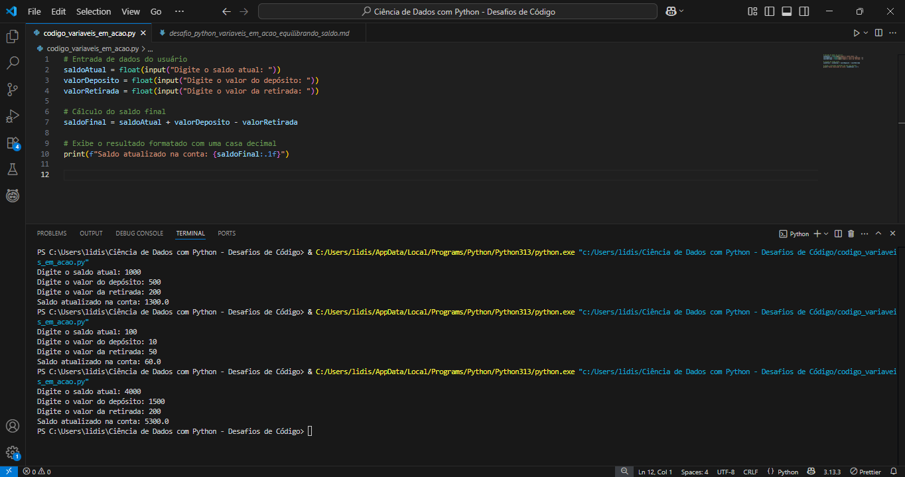
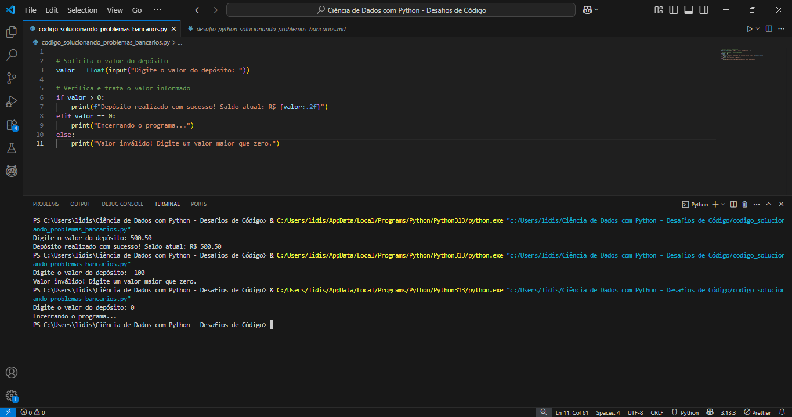
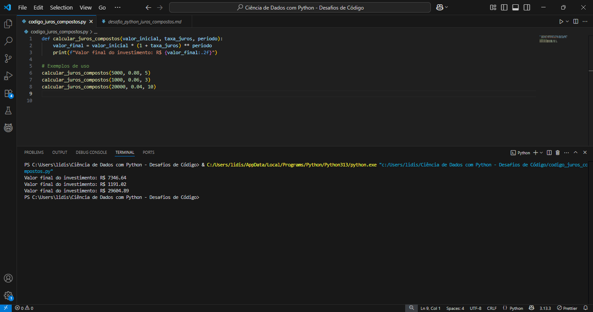
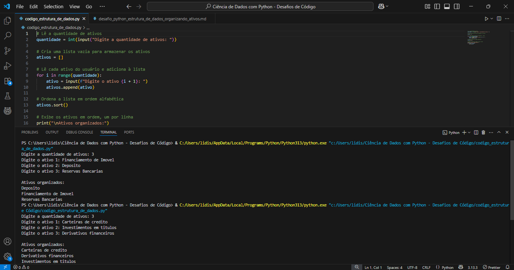
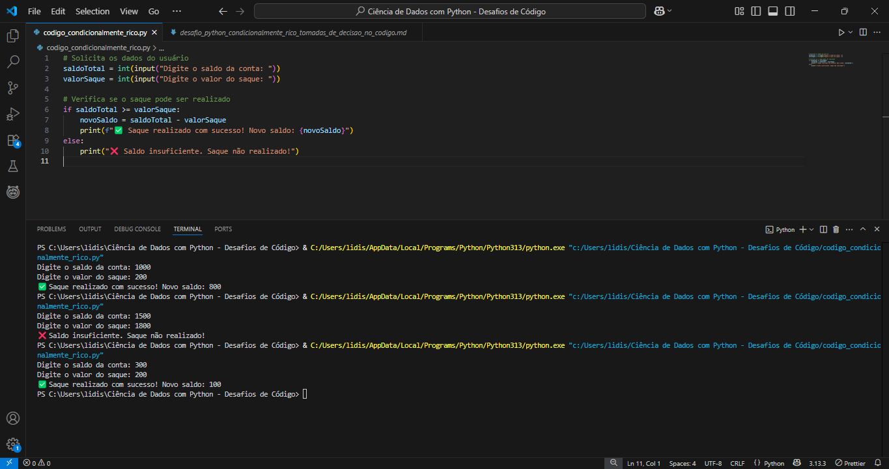

# 💻 Desafios de Códigos - Python

Este repositório contém os desafios resolvidos por mim durante o **Bootcamp Ciência de Dados com Python - Santander**, promovido pela [Digital Innovation One (DIO)](https://www.dio.me/).  

Todos os códigos foram criados utilizando **Python** no **Visual Studio Code** durante as atividades propostas no bootcamp.

---

## 📚 Visão Geral dos Desafios

| Desafio                 | Enunciados (.md)                                                                                     | Código (.py)                                                                                     | Execução (print)                                                                                                                                     |
|-------------------------|----------------------------------------------------------------------------------------------------|--------------------------------------------------------------------------------------------------|------------------------------------------------------------------------------------------------------------------------------------------------------|
| 💰 Variáveis em Ação    | [Desafio - Variáveis em Ação](./desafios/variaveis_em_acao_equilibrando_saldo.md)                 | [Código - Variáveis em Ação](./codigos/codigo_python_equilibrando_saldo.py)                     | <a href="./imagens/variaveis_em_acao.png" target="_blank"></a>                              |
| 🏦 O Grande Depósito     | [Desafio - O Grande Depósito](./desafios/grande_deposito_solucionando_problemas_bancarios.md)     | [Código - O Grande Depósito](./codigos/codigo_python_o_grande_deposito.py)                      | <a href="./imagens/o_grande_deposito.png" target="_blank"></a>                              |
| 📈 Juros Compostos      | [Desafio - Juros Compostos](./desafios/juros_compostos.md)                                        | [Código - Juros Compostos](./codigos/codigo_python_juros_compostos.py)                          | <a href="./imagens/juros_compostos.png" target="_blank"></a>                                  |
| 📊 Organizar Ativos     | [Desafio - Organizar Ativos](./desafios/estrutura_de_dados_organizando_seus_ativos.md)           | [Código - Organizar Ativos](./codigos/codigo_python_organizando_seus_ativos.py)                | <a href="./imagens/estrutura_de_dados_1.png" target="_blank"></a><br><a href="./imagens/estrutura_de_dados_2.png" target="_blank"></a> |
| 💸 Saque Condicional    | [Desafio - Saque Condicional](./desafios/condicionalmente_rico_tomadas_de_decisao_no_codigo.md)  | [Código - Saque Condicional](./codigos/codigo_python_condicionalmente_rico.py)                        | <a href="./imagens/condicionalmente_rico.png" target="_blank"></a>                      |

---

## 🛠️ Tecnologias utilizadas

- Python 3  
- VS Code  
- Git & GitHub  

---

## ▶️ Como executar os desafios

1. Clone o repositório para sua máquina:

```bash
git clone https://github.com/seu-usuario/desafios_codigos_python.git
```

2. Navegue até a pasta:

```bash
cd desafios_codigos_python
```

3. Execute o desafio desejado:

```bash
python nome_do_arquivo.py
```

---

## 🗂️ Estrutura de arquivos

```bash
desafios_codigos_python/
├── imagens/                    ← prints com os códigos e saídas
│   ├── variaveis_em_acao.png
│   ├── o_grande_deposito.png
│   ├── juros_compostos.png
│   ├── estrutura_de_dados_1.png
│   ├── estrutura_de_dados_2.png
│   ├── condicionalmente_rico.png
├── desafios/                   ← arquivos .md com os desafios
│   ├── variaveis_em_acao_equilibrando_saldo.md
│   ├── grande_deposito_solucionando_problemas_bancarios.md
│   ├── juros_compostos.md
│   ├── estrutura_de_dados_organizando_seus_ativos.md
│  ├── condicionalmente_rico_tomadas_de_decisao_no_codigo.md
├── codigos/                    ← arquivos .py com as soluções
│   ├── codigo_python_equilibrando_saldo.py
│   ├── codigo_python_o_grande_deposito.py
│   ├── codigo_python_juros_compostos.py
│   ├── codigo_python_organizando_seus_ativos.py
│   ├── codigo_python_condicionalmente_rico.py
│   ├── README.md

```

## 🖼️ Capturas de Tela

A pasta imagens/ contém os prints dos códigos em execução e os respectivos resultados no terminal. Isso facilita a visualização prática do comportamento dos desafios!

<table>
  <tr>
    <td align="center"><strong>💰<br>Variáveis em Ação</strong></td>
    <td align="center"><strong>🏦<br>O Grande Depósito</strong></td>
    <td align="center"><strong>📈<br>Juros Compostos</strong></td>
  </tr>
  <tr>
    <td>
      <a href="./imagens/variaveis_em_acao.png" target="_blank">
        
      </a>
    </td>
    <td>
      <a href="./imagens/o_grande_deposito.png" target="_blank">
        
      </a>
    </td>
    <td>
      <a href="./imagens/juros_compostos.png" target="_blank">
        
      </a>
    </td>
  </tr>
  <tr>
    <td align="center" colspan="2"><strong>📊<br>Organizando Ativos</strong></td>
    <td align="center"><strong>💸<br>Saque Condicional</strong></td>
  </tr>
  <tr>
    <td colspan="2">
      <div style="white-space: nowrap; overflow-x: auto;">
        <a href="./imagens/estrutura_de_dados_1.png" target="_blank" style="display: inline-block; margin-right: 10px;">
          
        </a>
        <a href="./imagens/estrutura_de_dados_2.png" target="_blank" style="display: inline-block;">
          
        </a>
      </div>
    </td>
    <td>
      <a href="./imagens/condicionalmente_rico.png" target="_blank">
        
      </a>
    </td>
  </tr>
</table>

---

## ✍️ Autora

Lidiane 📍 São Paulo, Brasil 
